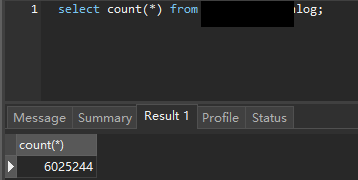
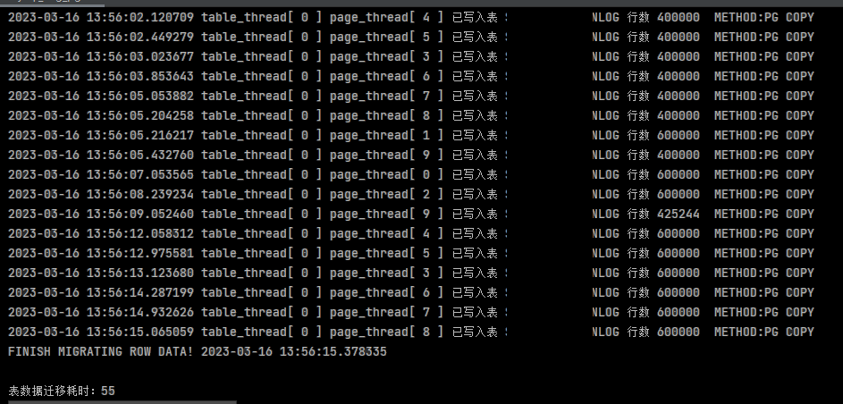

# mysql_mig_pg工具使用

## 一、工具特性以及环境要求


### 1.1 功能特性

支持MySQL数据库一键迁移到postgresql内核类型的目标数据库，如postgresql数据库、海量数据库vastbase、华为postgresql、电信telepg、人大金仓Kingbase V8R6等

- 运行在Windows以及Linux x86环境，无需繁琐部署，开箱即用，小巧轻量化

- 在线迁移MySQL到目标数据库的表、视图、索引、外键、自增列等对象

- 多进程并行迁移表数据，充分利用CPU多核性能

- 支持迁移源库部分表功能

- 记录迁移日志，转储表、视图等DDL对象创建失败的sql语句

- 提供数据库表行数比对功能，一键比对源库目标库数据

- 一键迁移MySQL到postgresql，方便快捷，轻松使用


### 1.2 环境要求
在运行的客户端PC需要同时能连通源端MySQL数据库以及目标数据库

支持Windows、Linux、MacOS

### 1.3 如何安装
解压之后即可运行此工具

若在Linux环境下请使用unzip解压，例如：


`[root@localhost opt]# unzip mysql_mig_pg.zip`

### 1.4 性能实测

硬件配置

`源库` MySQL 5.7.27

| 硬件 | 备注 |
|--------|--------|
|   CPU     |   8核     |
|   内存     |   16G     |
|   硬盘     |   SOLIDIGM P44 pro  PCIe 4.0 x4|


iops:

{

"rndrd":"44278.13",

"rndwr":"22289.36",

"seqrd":"54119.21",

"seqrewr":"42170.31",

"seqwr":"16259.62",

"seqwr_4":"15122.88",

"seqwr_1":"17974.13",

"fio_write":"22.4k",

"fio_write_16":"23.2k",

"fio_read":"30.7k",

"fio_read_16":"25.0k"

}


`目标库` Postgresql 12.7

| 硬件 | 备注 |
|--------|--------|
|   CPU     |   8核     |
|   内存     |   8G     |
|   硬盘     |   Samsung PM981A  PCIe 3.0 x4   |


iops:

{

"rndrd":"59293.79",

"rndwr":"40214.08",

"seqrd":"58308.63",

"seqrewr":"45607.57",

"seqwr":"13947.71",

"seqwr_4":"14049.61",

"seqwr_1":"17171.70",

"fio_write":"22.9k",

"fio_write_16":"22.3k",

"fio_read":"35.1k",

"fio_read_16":"26.1k"

}


测试表数据量600W+,使用此工具迁移耗时`55`秒




多进程写入目标数据库




## 二、全库迁移

### 2.1 Windows环境


1、编辑 config.ini文件，修改源数据库以及目标数据库信息

```bash
用记事本编辑config.ini 
[mysql]
host = 192.168.189.20
port = 3306
user = root
passwd = Gdemo
database = datatest
dbchar = utf8mb4
row_batch_size = 5000
split_page_size = 5000
table_split_thread = 4
mysql_fenye_parallel_run = 4

[postgresql]
host = 192.168.212.19
port = 54321
user = datatest
passwd = 11111
database = datatest

```


2、执行全库迁移

点击图标`start_mysql_mig_pg.bat`即可运行程序


```bash


+-----------------------------------------------------------+
|                         MysqlToPG                         |
+-----------------------------------------------------------+
|      One Key Migration Data from MySQL to PG So Easy      |
| Powered By: [DBA Group] of Infrastructure Research Center |
|                  Tool Version: 1.3.15-MP                  |
+-----------------------------------------------------------+
2023-03-15 15:41:25

源MySQL数据库连接信息: ip:192.168.1.37:3306 数据库名称: demo
源表总计: 914
源视图总计: 60
源触发器总计: 0
源存储过程总计: 12
源数据库函数总计: 7

目标postgresql数据库连接信息: 用户名:demo_cs ip:192.168.18.200:5432 数据库名称: demo_cs

是否准备迁移数据：Y|N

这里输入y开始迁移数据

```


`注意`


如果遇到报错:`ImportError:DLL load failed:找不到指定的模块`,这是由于当前使用环境缺失微软VC运行库

解决方法:

进入程序解压目录的`msvcr`文件夹，将此文件夹内的文件`msvcr120.dll`拷贝到`C:\Windows\System32`目录，
然后重新运行程序即可


3、查看数据迁移摘要

数据迁移完成之后，会在屏幕显示本次迁移的时间以及迁移过程中遇到的异常

```bash

************数据迁移摘要************

目标数据库: demo_test
1、表数量总计: 375 目标表创建成功计数: 375 目标表创建失败计数: 0
2、视图数量总计: 10 目标视图创建成功计数: 10 目标视图创建失败计数: 0
3、自增列数量总计: 19 目标自增列创建成功计数: 19 目标自增列修改失败计数: 0
4、触发器数量总计: 0 触发器创建成功计数: 0 触发器创建失败计数: 0
5、索引以及约束总计: 681 目标索引以及约束创建成功计数: 681 目标索引以及约束创建失败计数: 0
6、外键总计: 0 目标外键创建成功计数: 0 目标外键创建失败计数: 0

请检查创建失败的表DDL以及约束。有关更多详细信息，请参阅迁移输出信息
MySQL存储过程以及函数定义已转储到C:\mysql_to_pg\dist\mig_log\2022_01_14_16_34_19\proc_fun_sql.sql

迁移日志已保存到C:\mysql_to_pg\dist\mig_log\2022_01_14_16_34_19\
表迁移记录请查看insert_table.csv或者在目标数据库查询表my_mig_task_info
有关插入错误请查看ddl_failed_table.log以及insert_failed_table.log

```


### 2.2 Linux环境

1、编辑 config.ini文件，修改源数据库以及目标数据库信息

```bash

[root@localhost opt]# cd mysql_to_pg/

[root@localhost mysql_to_pg]# vi config.ini 

[mysql]
host = 192.168.1.37
port = 3306
user = root
passwd = Gdemo
database = demo
dbchar = utf8mb4
row_batch_size = 5000
split_page_size = 5000
table_split_thread = 4
mysql_fenye_parallel_run = 4

[postgresql]
host = 192.168.18.200
port = 5432
user = demo_cs
passwd = 11111
database = demo_cs

```


2、执行全库迁移


```bash

[root@localhost mysql_to_pg]# ./mysql_mig_pg


+-----------------------------------------------------------+
|                         MysqlToPG                         |
+-----------------------------------------------------------+
|      One Key Migration Data from MySQL to PG So Easy      |
| Powered By: [DBA Group] of Infrastructure Research Center |
|                  Tool Version: 1.3.15-MP                  |
+-----------------------------------------------------------+
2023-03-15 15:41:25

源MySQL数据库连接信息: ip:192.168.1.37:3306 数据库名称: demo
源表总计: 914
源视图总计: 60
源触发器总计: 0
源存储过程总计: 12
源数据库函数总计: 7

目标postgresql数据库连接信息: 用户名:demo_cs ip:192.168.18.200:5432 数据库名称: demo_cs

是否准备迁移数据：Y|N

这里输入y开始迁移数据

```


3、查看数据迁移摘要

数据迁移完成之后，会在屏幕显示本次迁移的时间以及迁移过程中遇到的异常

```bash

************数据迁移摘要************

MySQL迁移数据到postgresql完毕
开始时间:2022-01-14 15:53:52.443522
结束时间:2022-01-14 15:54:10.194539
耗时:17秒


目标数据库: demo_cs
1、表数量总计: 375 目标表创建成功计数: 375 目标表创建失败计数: 0
2、视图数量总计: 10 目标视图创建成功计数: 8 目标视图创建失败计数: 2
3、自增列数量总计: 19 目标自增列创建成功计数: 19 目标自增列修改失败计数: 0
4、触发器数量总计: 0 触发器创建成功计数: 0 触发器创建失败计数: 0
5、索引以及约束总计: 681 目标索引以及约束创建成功计数: 681 目标索引以及约束创建失败计数: 0
6、外键总计: 0 目标外键创建成功计数: 0 目标外键创建失败计数: 0

请检查创建失败的表DDL以及约束。有关更多详细信息，请参阅迁移输出信息
MySQL存储过程以及函数定义已转储到/opt/python_code/mysql_to_pg/mig_log/2022_01_14_15_53_00/proc_fun_sql.sql

迁移日志已保存到/opt/python_code/mysql_to_pg/mig_log/2022_01_14_15_53_00/
表迁移记录请查看insert_table.csv或者在目标数据库查询表my_mig_task_info
有关插入错误请查看ddl_failed_table.log以及insert_failed_table.log


```

4、查看迁移日志

迁移完成之后，在当前文件夹mig_log下面会生成时间戳名命的日志需要关注：

ddl_failed_table.log --> 创建失败的表、视图、索引、触发器等对象的DDL创建语句，此部分需要修改语法适配并重新在postgresql创建即可

insert_failed_table.log --> 表数据插入失败的对象名称，此部分需要重新对个别表重新迁移数据

ddl_function_procedure.sql --> MySQL导出的存储过程以及函数的定义，此部分需要修改语法适配并重新在目标创建即可

由于MySQL跟postgresql在默认值、保留字、触发器等多个方面与有差异，只需将以上创建失败的sql语句手动修改下，重新在postgresql执行创建即可。


## 三、迁移部分表以及数据

`以下以Linux环境为例，Windows环境可在cmd内调用迁移工具`

3.1 编辑custom_table.txt 文件仅迁移部分表及数据

`使用-c命令仅创建以及迁移部分表数据，此例为仅迁移表frame_user以及test`

```bash

[root@localhost mysql_to_pg]# vi custom_table.txt 
frame_user
test

[root@localhost mysql_to_pg]# ./mysql_mig_pg -c


+-----------------------------------------------------------+
|                         MysqlToPG                         |
+-----------------------------------------------------------+
|      One Key Migration Data from MySQL to PG So Easy      |
| Powered By: [DBA Group] of Infrastructure Research Center |
|                  Tool Version: 1.3.15-MP                  |
+-----------------------------------------------------------+
2023-03-15 15:47:29

源MySQL数据库连接信息: ip:192.168.1.20:3306 数据库名称: win

要迁移的表如下:
APP_INFO

是否准备迁移数据：Y|N
y


```


3.2 仅迁移数据（不包括表结构以及表索引）

`以下以Linux环境为例，Windows环境可在cmd内调用迁移工具`

`备注：使用-d命令前，需要确保postgresql数据库已经创建了该表的表结构`

```bash

[root@localhost mysql_to_pg]# ./mysql_mig_pg -d

+-----------------------------------------------------------+
|                         MysqlToPG                         |
+-----------------------------------------------------------+
|      One Key Migration Data from MySQL to PG So Easy      |
| Powered By: [DBA Group] of Infrastructure Research Center |
|                  Tool Version: 1.3.15-MP                  |
+-----------------------------------------------------------+
2023-03-15 15:47:29

源MySQL数据库连接信息: ip:192.168.1.20:3306 数据库名称: win

要迁移的表如下:
APP_INFO

是否准备迁移数据：Y|N
y


```


## 四、比对源库目标库数据

点击图标`start_compare_data.bat`即可运行程序


比对结束之后会生成结果表，可根据表行数结果，自行判断是否需要再次单独迁移部分表


## 五、存储过程以及函数

由于MySQL存储过程、函数与postgresql有较大差异(语法，类型，声明，形参，调用等不同)，MySQL跟postgresql不是同一作者写的数据库，通常需要人工翻译数据库SQL代码到目标数据库，使用此工具在迁移完毕时会转储MySQL的存储过程以及函数到文本文件（proc_fun_sql.sql），可根据此文本文件做修改适配到postgresql数据库。

附postgresql函数创建示例：




函数
CREATE OR REPLACE FUNCTION PUBLIC.uuid() 
RETURNS CHARACTER VARYING
LANGUAGE PLSQL
AS 
v_out text;
BEGIN
SELECT cast(sys_guid() AS text) INTO v_out FROM dual;
RETURN v_out;
END;


CREATE OR REPLACE  FUNCTION PUBLIC.fun_getpy(s CHARACTER VARYING) 
 RETURNS CHARACTER VARYING
 LANGUAGE PLSQL
AS  retval character varying;
  c character varying;
  l integer;
  b bytea;  
  w integer;
begin
l=length(s);
retval='';
while l>0 loop
  c=left(s,1);
  b=convert_to(c,'GB18030')::bytea;
  if get_byte(b,0)<127 then
    retval=retval || upper(c);
  elsif length(b)=2 then
    begin
    w=get_byte(b,0)*256+get_byte(b,1);
    
    if w between 48119 and 49061 then 
      retval=retval || 'J';
    elsif w between 54481 and 55289 then 
      retval=retval || 'Z';
    elsif w between 53689 and 54480 then 
      retval=retval || 'Y';
    elsif w between 51446 and 52208 then 
      retval=retval || 'S';
    elsif w between 52980 and 53640 then 
      retval=retval || 'X';
    elsif w between 49324 and 49895 then 
      retval=retval || 'L';
    elsif w between 45761 and 46317 then 
      retval=retval || 'C';
    elsif w between 45253 and 45760 then 
      retval=retval || 'B';
    elsif w between 46318 and 46825 then 
      retval=retval || 'D';
    elsif w between 47614 and 48118 then 
      retval=retval || 'H';
    elsif w between 50906 and 51386 then 
      retval=retval || 'Q';
    elsif w between 52218 and 52697 then 
      retval=retval || 'T';
    elsif w between 49896 and 50370 then 
      retval=retval || 'M';
    elsif w between 47297 and 47613 then 
      retval=retval || 'G';
    elsif w between 47010 and 47296 then
      retval=retval || 'F';
    elsif w between 50622 and 50905 then
      retval=retval || 'P';
    elsif w between 52698 and 52979 then
      retval=retval || 'W';
    elsif w between 49062 and 49323 then
      retval=retval || 'K';
    elsif w between 50371 and 50613 then 
      retval=retval || 'N';
    elsif w between 46826 and 47009 then
      retval=retval || 'E';
    elsif w between 51387 and 51445 then
      retval=retval || 'R';
    elsif w between 45217 and 45252 then 
      retval=retval || 'A';
    elsif w between 50614 and 50621 then 
      retval=retval || 'O';
    end if;
    end;
  end if;
  s=substring(s,2,l-1);
  l=l-1;
end loop;
return retval;
end;

```